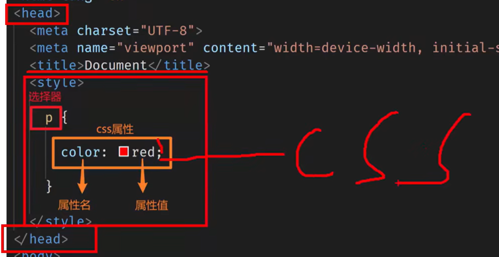
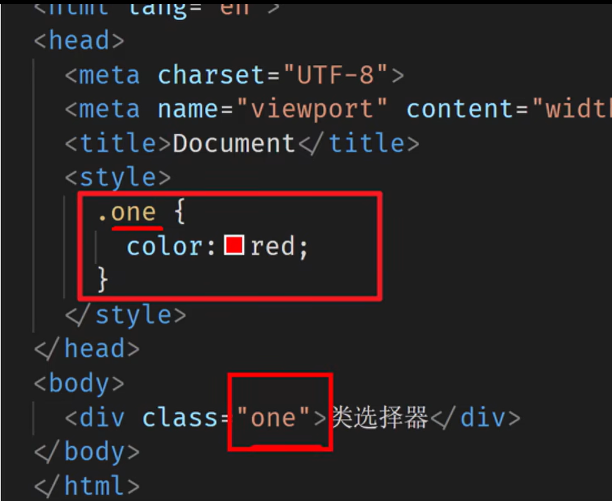
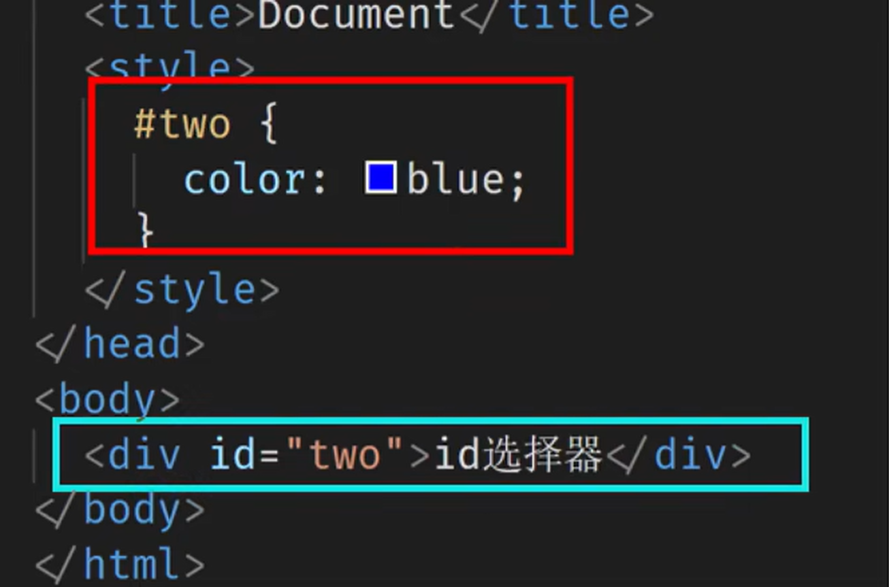
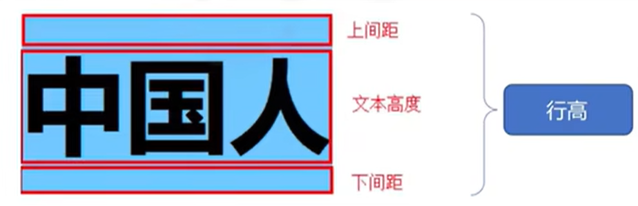
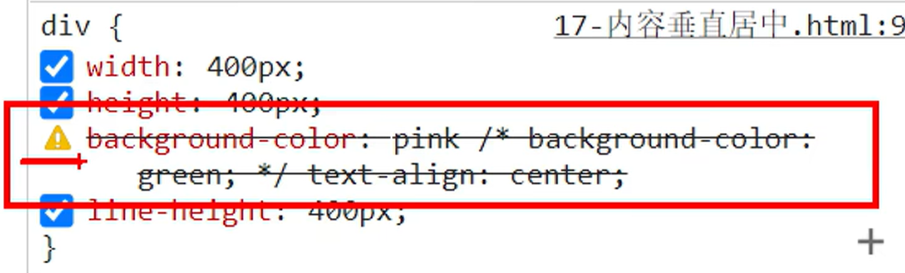

# 基本认知

1. CSS初识
2. CSS引入方式

## 介绍

CSS：层叠样式表

CSS作用：

- 给页面中的HMCL标签设置样式

## CSS语法规则

写在哪里？

- css写在style标签中，style标签一般写在head标签里面，title标签下面

怎么写？



文字颜色：color

文字大小：font-size

px：像素

```css
p {
	/* 文字颜色变成红色 */
	color: red;
    /* px 像素 */
	font-size: 30px;
	/* 属性名：属性值 */
	/* 背景色 */
    background-color: green;
    /* 宽高尺寸变化 */
    width: 400px;
    height: 400px;
}
```

# 引入方式

内嵌式：CSS写在style标签中

- 提示：style标签虽然可以写在页面任意位置，但是通常约定写在head标签中

外联式：CSS写在一个单独的.css文件中

- 提示：需要使用link标签在网页中引入
- 在html的head标签内，书写link标签，即可外联css文件，href填写css文件路径。

行内式：CSS写在标签的style属性中

- 提示：之后配合js使用

```css
<!-- css到底能写在哪里 -->
<!-- 关系：样式表 href 文件名 -->
<link rel="stylesheet" href="./my.css">
<p>这是p标签</p>
<!-- 内联式 -->
<div style="color: green; font-size-30px;">这是div标签</div>
```

CSS三种引入方式的特点区别

| 引入方式 | 书写位置                                 | 作用范围 | 使用场景   |
| -------- | ---------------------------------------- | -------- | ---------- |
| 内嵌式   | CSS写在style标签中                       | 当前页面 | 小案例     |
| 外联式   | CSS写在单独的css文件中，通过link标签引入 | 多个页面 | 项目中     |
| 行内式   | CSS写在标签的style属性中                 | 当前标签 | 配合js使用 |

# 基础选择器

1. 标签选择器
2. 类选择器
3. id选择器
4. 通配符选择器

## 标签选择器

结构：标签名 {css属性名:属性值;}

作用：通过标签名，找到页面中所有这类标签，设置样式

注意点：

1. 标签选择器选择是一类标签，而不是单独某一个
2. 标签选择器无论嵌套关系有多深，都能找到对应的标签

## 类选择器

结构：.类目{css属性名:属性值;}

作用：通过类名，找到页面中所有带有这个类名的标签，设置样式

注意点：

1. 所有标签上都有class属性，class属性的属性值称为类名。
2. 类名可以由数字、字母、下划线、中划线组成，但不能以数字或者中划线开头。
3. 一个标签可以同时有多个类名，类名之间以空格隔开。
4. 类名可以重复，一个类选择器可以同时选中多个标签。



	## id选择器

结构：#id属性名{cs属性名:属性值;}

作用：通过id属性值，找到页面中带有这个id属性值的标签，设置样式

注意点：

1. 所有标签上都有id属性
2. id属性值类似于身份证号码，在一个页面中是唯一的，不可重复的！
3. 一个标签上只能有一个id属性值
4. 一个id选择器只能选中一个标签

## 通配符选择器

结构：*{css属性名:属性值;}

作用：找到页面中所有的标签，设置样式

注意点：

1. 开发中使用极少，只会在极特殊情况下才会用到
2. 在基础班小页面中可能会用于去除标签默认的margin和padding
3. 通配符*一般只用在margin和padding情况下，使每一段之间的间隔减小

```css
* {
	margin: 0;
	padding: 0;
	}
```

# 字体和文本样式

1. 字体样式
    1. 字体大小：font-size
    2. 字体粗细：font-weight
    3. 字体样式：font-style
    4. 字体类型：font-family
    5. 字体类型：font属性连写
2. 文本样式
3. line-height行高

## 字体大小

属性名：font-size

取值：数字+px

注意点：

- 谷歌浏览器默认文字大小是16px
- 单位需要设置，否则无效

## 字体粗细

属性名：font-weight

取值：

- 关键字

    | 效果 | 取值   |
    | ---- | ------ |
    | 正常 | normal |
    | 加粗 | bold   |

- 纯数字：100~900的整百数：

    | 效果 | 取值 |
    | ---- | ---- |
    | 正常 | 400  |
    | 加粗 | 700  |

注意点：

- 不是所有字体都提供了九种粗细，因此部分取值页面中无变化。
- 实际开发中以：正常、加粗两种取值使用较多。

## 字体样式（是否倾斜）

属性名：font-style

取值：

- 正常（默认值）：normal
- 倾斜：italic

## 字体系列 font-family

属性名：font-family

常见取值：具体字体1，具体字体2，具体字体3……

- 具体字体：“Microsoft YaHei”、微软雅黑、黑体、宋体….
- 字体系列：sans-serif、serif、monospace等……

渲染规则：

1. 从左往右按顺序查找，如果电脑中未安装改字体，则显示下一字体
2. 如果都不支持，此时会根据操作系统，显示最后字体系列的默认字体

注意点：

1. 如果字体名称中存在多个单词，推荐使用引号包裹
2. 最后一项字体系列不需要引号包裹
3. 网页开发时，尽量使用系统常见自带字体，保证不同用户浏览器网页都可以正确显示

| 系统    | 默认字体 |
| ------- | -------- |
| windows | 微软雅黑 |
| mac     | 苹方     |

### 常见字体系列

#### 无衬线字体（sans-serif）

1. 特点：文字笔画粗细均匀，并且首尾无装饰
2. 场景：网页中大多采用无衬线字体
3. 常见该系列字体：黑体、Arial

#### 衬线字体（serif） 

1. 特点：文字笔画粗细不均，并且首位有笔锋装饰
2. 场景：报刊书籍中应用广泛
3. 常见该系列字体：宋体、Times New Roman

#### 等宽字体

1. 特点：每个字母或文字的宽度相等
2. 场景：一般用于程序代码编写、有利于代码的阅读和编写
3. 常见该系列字体：Consolas、fira code

## 样式的层叠问题

问题：

- 给同一个标签设置了相同的样式，此时浏览器会如何渲染呢？

结果：

- 如果给同一个标签设置了相同的属性，此时样式会层叠（覆盖），写在最下面的会生效

TIP：

- CSS层叠样式表
- 所谓的层叠即叠加的意思，表示样式可以一层一层的层叠覆盖

## 字体font相关属性的连写

属性名：font（符合属性）

取值：

- font：style weight size family

省略要求：

- 只能省略前两个，如果省略了相当于设置了默认值
- 各个值之间用空格隔开

注意点：如果需要同时设置单独和连写形式

- 要么把单独的样式写在连写的下面
- 要么把单独的样式写在连写的里面

## 文本样式

1. 文本缩进：text-indent
2. 文本水平对齐方式：text-align
3. 文本修饰：text-decoration

### 文本缩进

属性名：text-indent

取值：

- 数字+px
- 数字+em（推荐：1em=当前标签的font-size的大小，即一个字的大小）

### 文本水平对齐方式

属性名：text-align

取值：

| 属性值 | 效果     |
| ------ | -------- |
| left   | 左对齐   |
| center | 居中对齐 |
| right  | 右对齐   |

注意点：

- 如果需要让文本水平居中，text-align属性给文本所在标签	（文本的父元素）设置

#### text-align:center

能让哪些元素水平居中？

1. 文本
2. span标签、a标签
3. inpuy标签、img标签

1. 注意点：如果需要让以上元素水平居中，text-align:center需要给以下元素的父元素设置

### 文本修饰

属性名：text-decoration

取值：

| 属性值       | 效果               |
| ------------ | ------------------ |
| underline    | 下划线（常用）     |
| line-through | 删除线（不常用）   |
| overline     | 上划线（几乎不用） |
| none         | 无装饰线（常用）   |

注意点：

- 开发中会使用text-decoration:none;清除a标签默认的下划线

## 行高

作用：控制一行的上下行间距

属性名：line-height

取值：

- 数字+px
- 倍数（当前标签font-size的倍数）

应用：

1. 让单行文本垂直居中可以设置line-height：文字父元素高度
2. 网页精准布局时，会设置line-height：1可以取消上下间距

行高与font连写的注意点：

- 如果同时设置了行高和font连写，注意覆盖问题
- font：style weight size/line-height family；(倾斜 文字粗细 字号/行间距 字体)



## 拓展 颜色常见取值（了解）

属性名：

- 如：文字颜色：color
- 如：背景颜色：background-color

属性值：

| 颜色表示方式   | 表示含义                                | 属性值                                                 |
| -------------- | --------------------------------------- | ------------------------------------------------------ |
| 关键词         | 预定义的颜色名                          | red、green、blue、yellow……                             |
| 。。。         | 红绿蓝三原色。每项取值范围：0-255       | rgb(0,0,0)、rgb(255,255,255)……                         |
| rgba表示法     | 红绿蓝三原色+a表示透明度，取值范围是0~1 | rgba(255,255,255,0.5)、rgba(255,0,0,0.3)……             |
| 十六进制表示法 | #开头，将数字转换成十六进制表示         | #000000、#ff0000……简写：#000、#f00（两两一组，可简写） |

## 拓展 标签水平居中方法总结 margin：0 auto

如何需要让div、p、h（大盒子）水平居中？

- 可以通过margin:0 auto 实现（复合属性写法）

注意点：

1. 如果需要让div、p、h（大盒子）水平居中，直接给当前元素本身设置即可
2. margin:0 auto 一般针对于固定宽度的盒子，如果大盒子没有设置宽度，此时会默认占满父元素的宽度

# Chrome调试工具

F12	–>	开发者工具



遇到感叹号说明CSS语法写的有问题